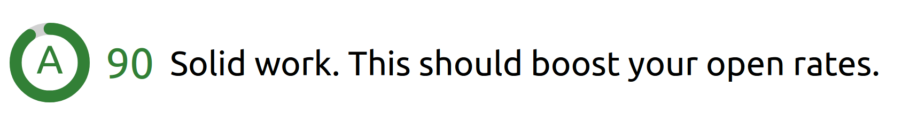

# Package Name
An email subject score components, to determine the effectiveness of your subject line with a colorful presentation.

## Installation
Install with npm:
``` bash
npm install "Package Name"
```

## Usage
Import the component:
```bash
import {SubjectScore} from 'package name'
```
Now you can use the component as a child component:
```bash
<SubjectScore subject={value} />
```
where *value* is the **subject line** that you want to test.

## props
| Name              | Description                                                                                               |
|:-----------------:|:---------------------------------------------------------------------------------------------------------:|
| `subject`         | The subject line that you need to test. **Required**                                                      |
| `showDescription` | To display the test description or not. *Optional*  `Default: false`                                      |
| `apiDelay`        | To add delay in seconds before calling the api to let user finish typing. *Optional* `Default: 2secs(min)`|

## Understanding the output

| Score | Grade | Color |
|:-------:|:-:|:--------------------------------------:|
| 100     | A+| $$\textcolor{#388E3C}{\text{Green}}$$  |
| 90 - 99 | A | $$\textcolor{#388E3C}{\text{Green}}$$  |
| 80 - 90 | B |$$\textcolor{#388E3C}{\text{Green}}$$   |
| 75 - 80 | C | $$\textcolor{#388E3C}{\text{Green}}$$  |
| 70 - 74 | C | $$\textcolor{#42A5F5}{\text{Blue}}$$   |
| 60 - 69 | D | $$\textcolor{#42A5F5}{\text{Blue}}$$   |
| 40 - 59 | D | $$\textcolor{#F57C00}{\text{Orange}}$$ |
| 20 - 39 | D | $$\textcolor{#AB47BC}{\text{Purple}}$$ |
| 0 - 19  | D | $$\textcolor{#D32F2F}{\text{Red}}$$    |
## License